# library-api-assignment

A school project for the courses Java Spring and Säker mjukvara ("Secure Software").

## Table of Contents

1. [About](#library-api-assignment)
2. [Features](#features)

    2.1. [Backend](#backend)

    2.2. [Frontend](#frontend)

3. [Screenshots](#screenshots)

    3.1. [Home page](#home-page)

    3.2. [Authentication](#authentication)

    3.3. [Books](#books)

    3.4. [My loans](#my-loans)

    3.5. [Logs](#logs)

    3.6. [Error](#error)

4. [Future Improvements & Notes](#future-improvements--notes)

## About

A school project (spanning 2 courses) built in Java, featuring a simple library REST API. Using Spring Boot, Spring Web, Spring Data JPA,
SQLite and Maven.

Featured with a basic dashboard-like frontend besides the assignment, using React, TypeScript, React Router, SWR, TailwindCSS and shadcn/ui.

Assignment criterias can be found here:

-   [Java Spring](https://github.com/THS24-Spring-Boot/Spring-Boot-Start/blob/main/projekt/kravspec-bibblan.md)
-   [Säker mjukvara](https://github.com/nilsedgarjacobsen/THS24-sakermjukvara/blob/main/spring_security_exam.md)

## Features

### Backend

-   Authentication using JWT (access and revokable refresh tokens)
-   Authorization with roles
-   Login brute force protection
-   Rate limiting per ip
-   Audit logging involving important user actions
-   Get, search and create books. With pagination, sorting and filtering.
-   Get, search and create authors.
-   Get and create users.
-   Get user loans.
-   Create, return and extend loans
-   \*Unit & integration tests for loans (mainly creating them)

> \*Controller tests are currently broken, as the the tests are not up to date with the current code regarding authentication and authorization.

### Frontend

-   Automatic handling of JWT refresh tokens when access token expires
-   Login, logout and register
-   Paginated view of all books
-   View your own loans
-   Overview of JWT information for debug & development purposes
-   Abiltity to create books
-   Barebones page for viewing audit logs

## Screenshots

### Home page

#### As a guest

#### As a user

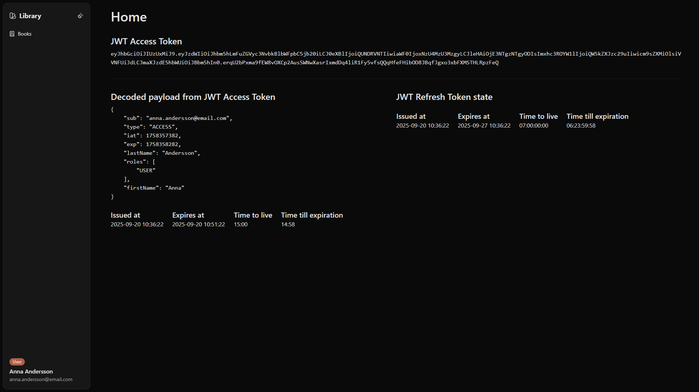

#### As an admin

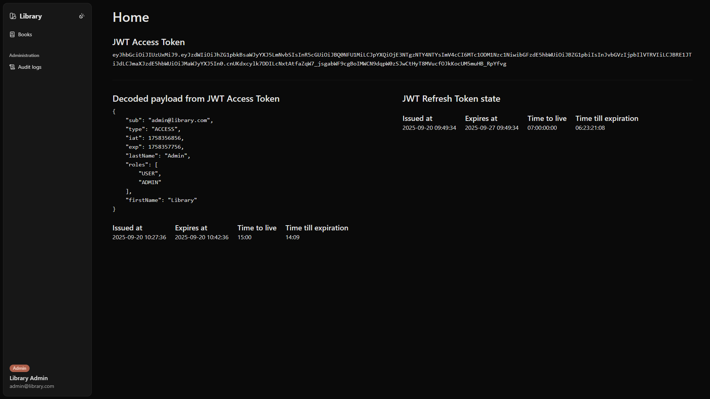

### Authentication

#### Register

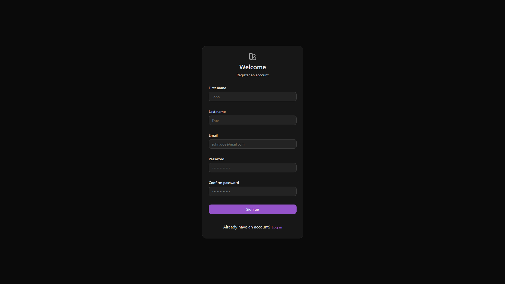

#### Login

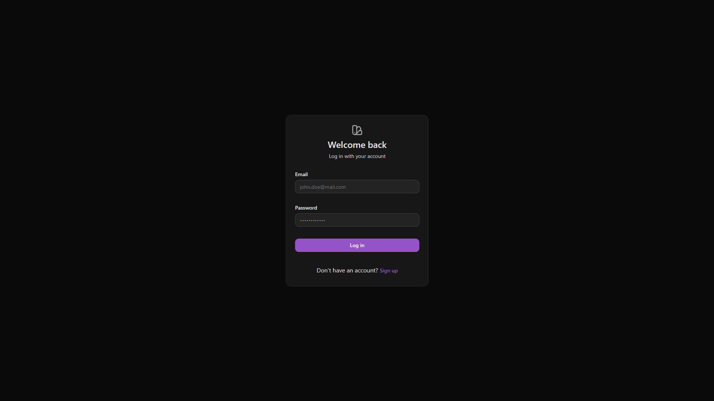

#### Logout

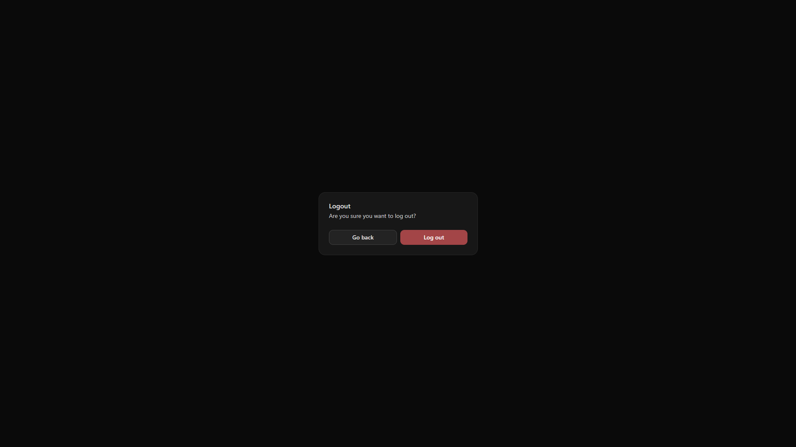

### Books

#### Grid view of all books

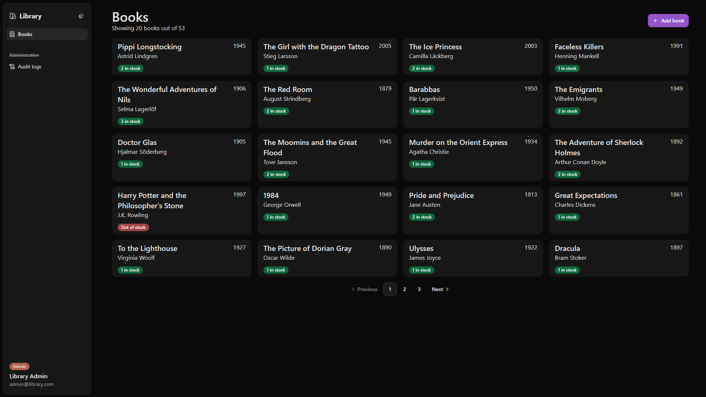

#### Create book

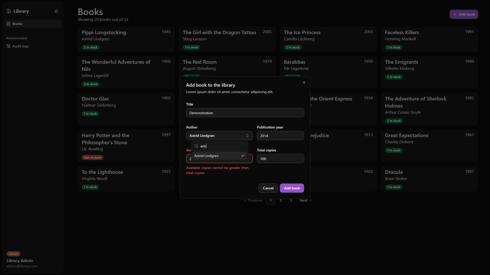

### My loans

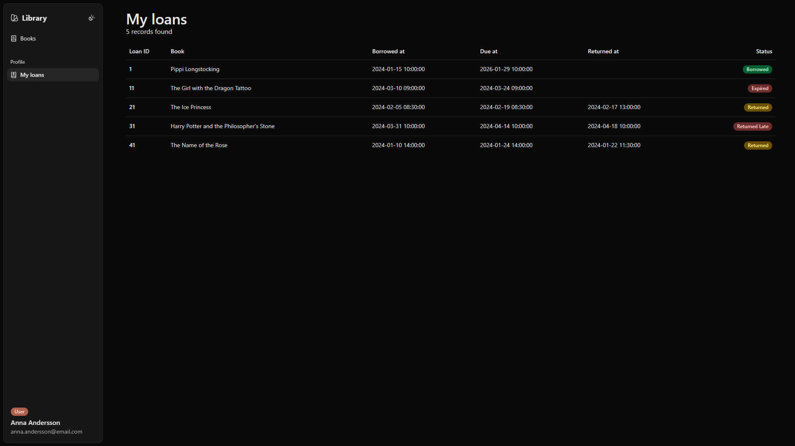

### Logs

#### Table view of audit logs

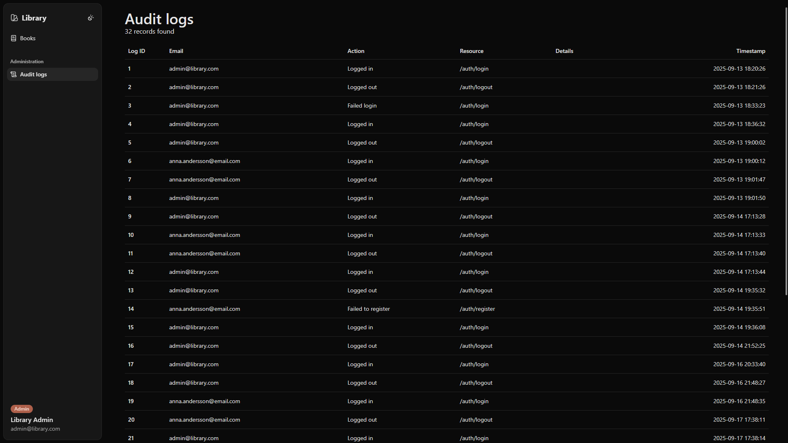

### Error

#### 403 Forbidden

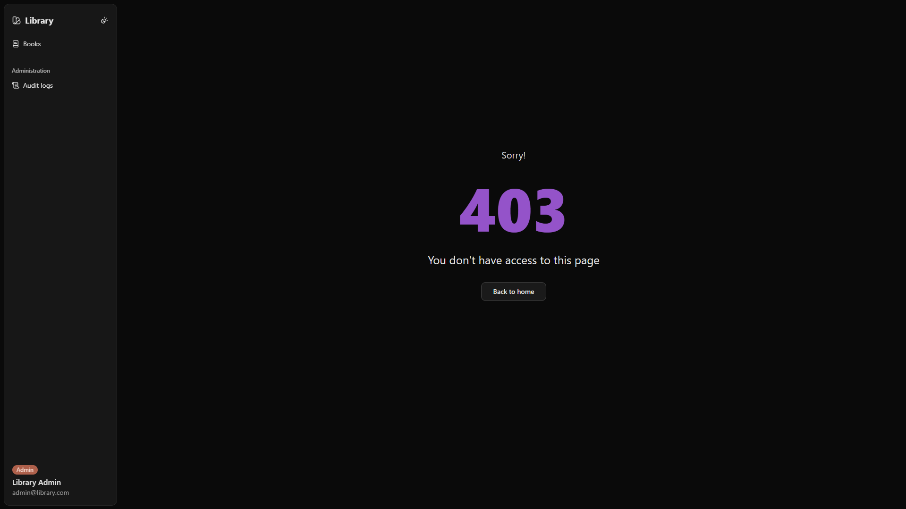

#### 404 Not found

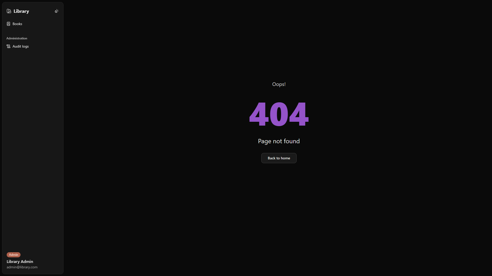

## Future Improvements & Notes

Possible future improvements and concerns that I currently have with the project:

-   The frontend is currently not very user friendly. It is built as a dashboard-like application, and not separated into a user interface and an admin dashboard. Also not responsive.

-   The frontend basically contains nothing, just a picked few features to help while fulfilling [the criterias of the assigment](https://github.com/nilsedgarjacobsen/THS24-sakermjukvara/blob/main/spring_security_exam.md).

-   I would say the frontend has no sense of modularity, no generic components on top of shadcn/ui, no reusability of e.g forms etc.

-   Barely any unit tests for the backend (which 1/3 is failing).

-   No unit tests for the frontend either.

-   [API Response class](backend/src/main/java/com/kr/libraryapiassignment/response/ApiResponse.java) could definitely be improved upon. It is currently a bit of a mess with being a mix of a normal class and a builder.

-   Decisions are not entirely thought through, with a lot of them being based on the course requirements and just getting it to work.

-   Backend currently using a SQLite database, as that was included into the assignment. Would be better off using a more suitable database like PostgreSQL or MySQL.
